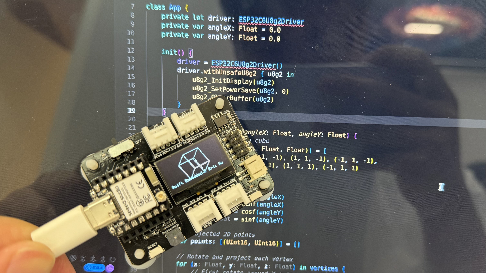

# Swift Embedded ESP32C6 OLED Demo

<p align="center">
  
</p>

This project demonstrates how to use Swift in an embedded environment with ESP32C6, featuring a rotating 3D cube animation on an OLED display.

## Project Structure

```
.
├── CMakeLists.txt              # Main CMake configuration
├── main/
│   ├── CMakeLists.txt         # Component CMake configuration
│   ├── Package.swift          # Swift package manifest
│   └── Source/
│       ├── App/               # Main application code
│       └── Support/           # Support code and fonts
└── sdkconfig                  # ESP-IDF configuration
```

## Key Features

- Swift embedded programming on ESP32C6
- OLED display support using U8g2
- 3D graphics rendering
- I2C communication

## Integration Guide

### 1. Swift Package Manager Integration

To integrate Swift Package Manager with CMake in an embedded environment:

1. Create a `Package.swift` file in your component directory:
```swift
// swift-tools-version: 6.1
import PackageDescription

let package = Package(
    name: "App",
    products: [
        .library(
            name: "App", 
            type: .static, 
            targets: ["App"]),
    ],
    dependencies: [
        .package(url: "https://github.com/CmST0us/U8g2Kit", branch: "main", traits: ["Embedded"]),
    ],
    targets: [
        .target(
            name: "App",
            dependencies: [
                "Support",
                .product(name: "U8g2Kit", package: "U8g2Kit"),
                .product(name: "CU8g2", package: "U8g2Kit")],
            swiftSettings: [
                .swiftLanguageMode(.v5),
                .enableExperimentalFeature("Embedded"),
            ]),

        .target(name: "Support",
            swiftSettings: [
                .swiftLanguageMode(.v5),
                .enableExperimentalFeature("Embedded"),
            ]),
    ]
)
```

2. Configure CMakeLists.txt to build Swift code:

> Thanks to [https://github.com/anders0nmat/swift-embedded-pm](https://github.com/anders0nmat/swift-embedded-pm)

Add custom command to run swift build to make embedded libApp.a
```cmake
add_custom_target(swift-archive
	COMMAND
		# Remove the archive. Swift does not overwrite this on building but merges them.
		# If the file with app_main gets renamed, both objectfiles (old and new) will be in the archive, potentially causing problems
		rm -f ${SWIFT_PRODUCT_ARCHIVE}
		&&
		${SWIFT_TOOLCHAIN}/swift package update
			--package-path ${COMPONENT_DIR}	
		&&
		${SWIFT_TOOLCHAIN}/swift build
			-c release
			--package-path ${COMPONENT_DIR}
			
			--triple ${SWIFT_TARGET}
			-Xswiftc -target -Xswiftc riscv32-none-none-eabi
			-Xswiftc -enable-experimental-feature -Xswiftc Embedded
			-Xswiftc -wmo
			-Xswiftc -parse-as-library
			-Xswiftc -Osize
			-Xswiftc -Xfrontend -Xswiftc -function-sections
			-Xswiftc -Xfrontend -Xswiftc -enable-single-module-llvm-emission
			-Xlinker -lgcc
			-Xlinker -lm 

			-Xswiftc -pch-output-dir -Xswiftc /tmp

			-Xcc ${march_flag} 
			-Xcc ${mabi_flag} 
			-Xcc -fno-pic 
			-Xcc -fno-pie
			
			# Get includes for C-std libraries and extra components
			${SWIFT_INCLUDES_LIST}
            $$\( echo '$<TARGET_PROPERTY:__idf_main,INCLUDE_DIRECTORIES>' | tr '\;' '\\n' | sed -e 's/\\\(.*\\\)/-Xcc -I\\1/g' \)
	BYPRODUCTS
		${SWIFT_PRODUCT_ARCHIVE}
)
```

### 2. Swift to C Interoperability

When working with Swift->C->ESP-IDF symbols (e.g., `i2c_driver_install`), you might encounter linking errors. To resolve this:

```
// Reference to ESP32U8g2Driver.swift
init() {
    super.init(u8g2_Setup_ssd1306_i2c_128x64_noname_f, &U8g2Kit.u8g2_cb_r0)
    // Mask use this, otherwise i2c_driver_install will not found
    let installHandler = i2c_driver_install
}
```

### 3. U8g2 Font Optimization

To reduce binary size when using U8g2 fonts:

1. Extract required fonts to a separate C file:
```c
// font.c
#include "font.h"
const uint8_t *default_font_5x7 = "...";  // Font data
```

2. Include only necessary fonts in your build.

### 4. Known Issues

#### SourceKit-LSP Support

Currently, SourceKit-LSP doesn't work properly in the embedded Swift environment. This affects:
- Code completion
- Symbol navigation
- Error reporting

Potential workarounds:
1. Use a text editor with basic syntax highlighting
2. Maintain a separate Swift package for development
3. Use command-line tools for building and debugging

## Building and Running

1. Install ESP-IDF and Swift toolchain
2. Configure the project:
```bash
idf.py set-target esp32c6
idf.py menuconfig
```

3. Build and flash:
```bash
idf.py build
idf.py -p (PORT) flash
```

## Contributing

Contributions are welcome! Please feel free to submit a Pull Request.

## License

This project is licensed under the Apache License 2.0 - see the LICENSE file for details.
